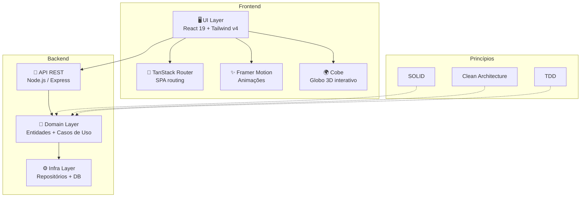

# 🏦 DIO Bank Pro — Core Bancário

<p align="center">
  
  
  
  
  
  
  
</p>

<p align="center">
  <b>Core bancário open source em TypeScript</b> — Clean Architecture, princípios SOLID, testes automatizados e documentação profissional.
</p>

<p align="center">
  <a href="https://dio-bank-pro-web.vercel.app" target="_blank">🌐 Live Demo</a> •
  <a href="https://github.com/matheusflorindo32/dio-bank-pro" target="_blank">🔗 Backend</a> •
  <a href="#-arquitetura">📐 Arquitetura</a> •
  <a href="#-funcionalidades">✨ Funcionalidades</a> •
  <a href="#-instalacao">🚀 Instalação</a>
</p>

---

## 🎯 Sobre o Projeto

**DIO Bank Pro** é a evolução do desafio prático da DIO em um **sistema fintech modular**, construído com as melhores práticas de engenharia de software.

Não é apenas um CRUD bancário. É um **core bancário completo** que demonstra:
- **Clean Architecture** — domínio isolado de frameworks
- **Princípios SOLID** — código sustentável e testável
- **TypeScript estrito** — tipagem ponta a ponta, sem `any`
- **Testes automatizados** — cobertura desde o domínio até a UI
- **Landing page premium** — experiência visual com globo 3D interativo e animações fluidas

---

## 🏗️ Arquitetura



---

## 🎨 Design System

| Token | Valor | Uso |
|-------|-------|-----|
| **Primary** | `#2D8A9E` | CTA, links, acentos |
| **Background** | `#0B0F19` | Base escura |
| **Surface** | `#111827` | Cards, painéis |
| **Text Primary** | `#F8FAFC` | Títulos |
| **Text Secondary** | `#94A3B8` | Body, descrições |
| **Accent** | Gradient `#2D8A9E → #1E6B7D` | Destaques, badges |
| **Fonte Display** | Instrument Serif | Títulos principais |
| **Fonte Body** | Inter | Texto, labels, UI |

---

## ✨ Funcionalidades

<table>
<tr>
<td width="33%">

### 🧩 TypeScript Estrito
Tipagem ponta a ponta, sem `any`. Erros pegos em build, não em produção.

</td>
<td width="33%">

### 🏗️ Clean Architecture
Domínio isolado de frameworks, banco e UI. Regras de negócio no centro.

</td>
<td width="33%">

### ⚖️ SOLID na Prática
Cada módulo com responsabilidade única e dependências injetadas por contrato.

</td>
</tr>
<tr>
<td>

### 🧪 Testes Automatizados
TDD, cobertura de edge cases e mocks limpos desde o início.

</td>
<td>

### 📄 Documentação Profissional
README, ADRs, diagramas e guias de contribuição.

</td>
<td>

### 🌿 Git Flow
Branches, PRs, commits semânticos e CI/CD configurado.

</td>
</tr>
</table>

---

## 🚀 Instalação

### Pré-requisitos

- [Bun](https://bun.sh) (recomendado) ou Node.js 20+
- Git

### Clone

```bash
# Clone o frontend
git clone https://github.com/matheusflorindo32/core-bancario.git
cd core-bancario

# Clone o backend (opcional)
git clone https://github.com/matheusflorindo32/dio-bank-pro.git
```

### Instalação

```bash
# Usando Bun (recomendado)
bun install

# Ou npm
npm install
```

### Ambiente de Desenvolvimento

```bash
# Inicia o servidor de desenvolvimento
bun run dev

# Build para produção
bun run build

# Preview da build
bun run preview

# Lint e formatação
bun run lint
bun run format
```

---

## 📂 Estrutura de Pastas

```
core-bancario/
├── src/
│   ├── components/
│   │   ├── site/           # Componentes da landing page
│   │   │   ├── nav.tsx
│   │   │   ├── hero.tsx
│   │   │   ├── features-bento.tsx
│   │   │   ├── metrics.tsx
│   │   │   ├── architecture.tsx
│   │   │   ├── principles-strip.tsx
│   │   │   └── footer.tsx
│   │   ├── ui/             # Componentes shadcn/ui (Radix + Tailwind)
│   │   └── globe-global.tsx  # Globo 3D COBE
│   ├── routes/
│   │   ├── __root.tsx
│   │   └── index.tsx       # Landing page
│   ├── router.tsx
│   ├── styles.css
│   ├── server.ts           # SSR server (Nitro)
│   └── start.ts
├── .lovable/               # Configuração Lovable
├── public/                 # Assets estáticos
├── bun.lock
├── package.json
├── tsconfig.json
├── vite.config.ts
├── tailwind.config.js
└── README.md               # ← você está aqui
```

---

## 🛠️ Stack Tecnológico

### Frontend
| Tecnologia | Versão | Propósito |
|------------|--------|-----------|
| React | 19.2 | UI library |
| TanStack Router | 1.17 | Roteamento SPA |
| Tailwind CSS | 4.2 | Estilização utilitária |
| Framer Motion | 12.42 | Animações declarativas |
| Cobe | 2.0 | Globo 3D interativo |
| Radix UI | latest | Primitivos acessíveis |
| shadcn/ui | latest | Componentes reutilizáveis |
| Vite | 8.0 | Build tool |
| Nitro | 3.0 | SSR server |

### Backend
| Tecnologia | Propósito |
|------------|-----------|
| Node.js | Runtime |
| Express | Framework web |
| TypeScript | Tipagem estática |
| Jest | Testes unitários |
| TypeORM / Prisma | ORM (a definir) |

---

## 🧪 Testes

```bash
# Executa todos os testes
bun run test

# Executa com watch mode
bun run test:watch

# Cobertura
bun run test:coverage
```

---

## 🗺️ Roadmap

- [x] Landing page com design premium
- [x] Globo 3D interativo (COBE)
- [x] Animações com Framer Motion
- [x] Clean Architecture + SOLID
- [x] TypeScript estrito
- [ ] Painel administrativo
- [ ] Integração com API REST
- [ ] Autenticação JWT
- [ ] Dashboard de métricas
- [ ] Dark mode nativo
- [ ] PWA
- [ ] Testes E2E (Playwright)

---

## 🤝 Como Contribuir

1. **Fork** o repositório
2. Crie uma **branch** (`git checkout -b feat/nova-feature`)
3. **Commit** suas mudanças (`git commit -m 'feat: adiciona nova feature'`)
4. **Push** para a branch (`git push origin feat/nova-feature`)
5. Abra um **Pull Request**

> ⚠️ **Importante:** Este projeto está conectado ao [Lovable](https://lovable.dev). Evite reescrever histórico publicado (force push, rebase, amend) para não perder o histórico no editor.

---

## 📜 Licença

Este projeto está licenciado sob a **MIT License** — veja o arquivo [LICENSE](LICENSE) para detalhes.

---

## 👤 Autor

**Matheus Florindo de Deus**
- 🎓 Aluno de Análise e Desenvolvimento de Sistemas — IFES
- 🎓 Licenciado em Educação Física — UniVitória
- 🔬 Pesquisador UFES (ORCID: 0009-0006-3848-0662)
- 💻 Especialista em Cloud Computing, Big Data e Segurança da Informação
- 📧 matheusdideusf@gmail.com

---

<p align="center">
  <i>Feito com ❤️‍🔥 e disciplina — NÃO NEGOCIE COM SUA MENTE!</i>
</p>

<p align="center">
  <a href="https://dio-bank-pro-web.vercel.app">🌐 Live Demo</a> •
  <a href="https://github.com/matheusflorindo32/dio-bank-pro">🔗 Backend</a>
</p>
